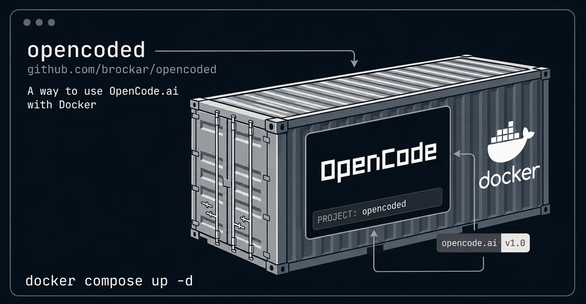

# OpenCode Dev Container

<!--toc:start-->
- [OpenCode Dev Container](#opencode-dev-container)
  - [Features](#features)
  - [Quick Start](#quick-start)
    - [Clone the repository](#clone-the-repository)
    - [Prerequisites](#prerequisites)
    - [Using Docker Compose (recommended)](#using-docker-compose-recommended)
    - [Using the helper script](#using-the-helper-script)
  - [Docker Run Examples](#docker-run-examples)
    - [Web Server](#web-server)
    - [TUI Mode](#tui-mode)
  - [Configuration](#configuration)
    - [Helper Script Environment Variables](#helper-script-environment-variables)
    - [Volume Mounts](#volume-mounts)
    - [Environment Variables](#environment-variables)
  - [Shell Alias (Recommended)](#shell-alias-recommended)
  - [Customizing the Image](#customizing-the-image)
<!--toc:end-->



A Dockerized way to run [OpenCode](https://opencode.ai) — the AI-powered coding assistant — in both **web-based** and **TUI** modes. This container packages OpenCode with all dependencies, providing isolated, reproducible environments for AI-assisted development.

## Features

- **Web Interface**: Access OpenCode through your browser
- **TUI Mode**: Run OpenCode directly in your terminal for a native CLI experience
- **Multiple Instances**: Run several OpenCode containers simultaneously on different ports for different projects — [guide](docs/multiple_instances.md)
- **Persistent Configuration**: Your OpenCode settings and authentication persist across container restarts
- **Git Integration**: SSH keys mounted for seamless git operations
- **Project Isolation**: Each container works on a specific project directory

## Quick Start

### Clone the repository

```bash
git clone https://github.com/brockar/opencoded.git ~/opencoded
cd ~/opencoded
```

### Prerequisites

Before running, make sure you have:

- Your **SSH key** at `~/.ssh/id_ed25519` (for git operations inside the container)
- **OpenCode authentication** configured (see [Configuration](#configuration) below)

### Using Docker Compose (recommended)

```bash
docker compose up -d
```

The web interface will be available at: **<http://localhost:4096>**

### Using the helper script

```bash
~/opencoded/run.sh
```

Run on a specific project:

```bash
PROJECT_PATH=/path/to/project ~/opencoded/run.sh
```

## Docker Run Examples

### Web Server

```bash
docker run -d \
  --name opencoded \
  --rm \
  --user "$(id -u):$(id -g)" \
  -p 4096:4096 \
  -v $(pwd):/workspace \
  -v ~/.ssh/id_ed25519:/home/opencoded/.ssh/id_ed25519:ro \
  -v ~/.config/opencode:/home/opencoded/.config/opencode \
  -v ~/.local/share/opencode/auth.json:/home/opencoded/.local/share/opencode/auth.json \
  -e GH_TOKEN=${GH_TOKEN:-} \
  -e OPENCODE_SERVER_USERNAME=${OPENCODE_SERVER_USERNAME:-opencode} \
  -e OPENCODE_SERVER_PASSWORD=${OPENCODE_SERVER_PASSWORD:-} \
  ghcr.io/brockar/opencoded:latest web --hostname 0.0.0.0 --port 4096
```

Then access at: **<http://localhost:4096>**

### TUI Mode

Run OpenCode in TUI:

```bash
docker run -it \
  --rm \
  --user "$(id -u):$(id -g)" \
  -v $(pwd):/workspace \
  -v ~/.ssh/id_ed25519:/home/opencoded/.ssh/id_ed25519:ro \
  -v ~/.config/opencode:/home/opencoded/.config/opencode \
  -v ~/.local/share/opencode/auth.json:/home/opencoded/.local/share/opencode/auth.json \
  -e GH_TOKEN=${GH_TOKEN:-} \
  ghcr.io/brockar/opencoded:latest
```

This starts the TUI interface directly in your terminal.  
Exit with `Ctrl+C` or type `/exit`.

## Configuration

### Helper Script Environment Variables

| Variable | Description | Default |
|----------|-------------|---------|
| `PROJECT_PATH` | Path to project directory | `$(pwd)` |
| `OPENCODE_PORT` | Host port to expose | `4096` |
| `UID` | User ID for file permissions | `$(id -u)` |
| `GID` | Group ID for file permissions | `$(id -g)` |

### Volume Mounts

The container mounts:

- `Project directory` → project (your project files or your projects)
- `~/.ssh/id_ed25519` → SSH key for git operations
- `~/.config/opencode` → OpenCode configuration
- `~/.local/share/opencode/auth.json` → OpenCode authentication

> [!TIP]
> **Persist sessions:** By default only `auth.json` is mounted. To also keep conversation history, mount the full directory instead:
>
> ```bash
> # replace this:
> -v ~/.local/share/opencode/auth.json:/home/opencoded/.local/share/opencode/auth.json
> # with:
> -v ~/.local/share/opencode:/home/opencoded/.local/share/opencode
> ```

> [!TIP]
> **Mount your entire code directory:** Instead of mounting a single project, mount your whole `~/code` directory as the workspace. This lets you open any project from the web UI without restarting the container, and keeps all session history consolidated in one place:
>
> ```bash
> -v ~/code:/workspace
> ```
>
> Then navigate to the specific project inside the UI (e.g. `/workspace/my-project`).

### Environment Variables

| Variable | Description | Default |
|----------|-------------|---------|
| `GH_TOKEN` | GitHub token (optional) | - |
| `OPENCODE_SERVER_USERNAME` | Username for HTTP Basic Auth (web mode) | `opencode` |
| `OPENCODE_SERVER_PASSWORD` | Password for securing the web interface | - |

## Shell Alias (Recommended)

Run the setup script — it auto-detects **zsh** (preferred) or **bash** and wires everything up:

```bash
~/opencoded/setup_shell.sh
```

Then reload your shell. For manual setup and all available options, see [Shell Setup Guide](docs/shell-setup.md).

## Customizing the Image

```dockerfile
RUN apt-get update && apt-get install -y --no-install-recommends \
  your-package-here \
  && rm -rf /var/lib/apt/lists/*
```

For the slim image, edit `Dockerfile.slim` and use `apk`:

```dockerfile
RUN apk add --no-cache your-package-here
```

Then rebuild locally:

```bash
# Standard
docker build -t ghcr.io/brockar/opencoded:latest .
# Slim
docker build -f Dockerfile.slim -t ghcr.io/brockar/opencoded:slim .
```

> [!NOTE]
> Always pair `apt-get install` with `rm -rf /var/lib/apt/lists/*` in the same `RUN` layer to keep the image size small.
